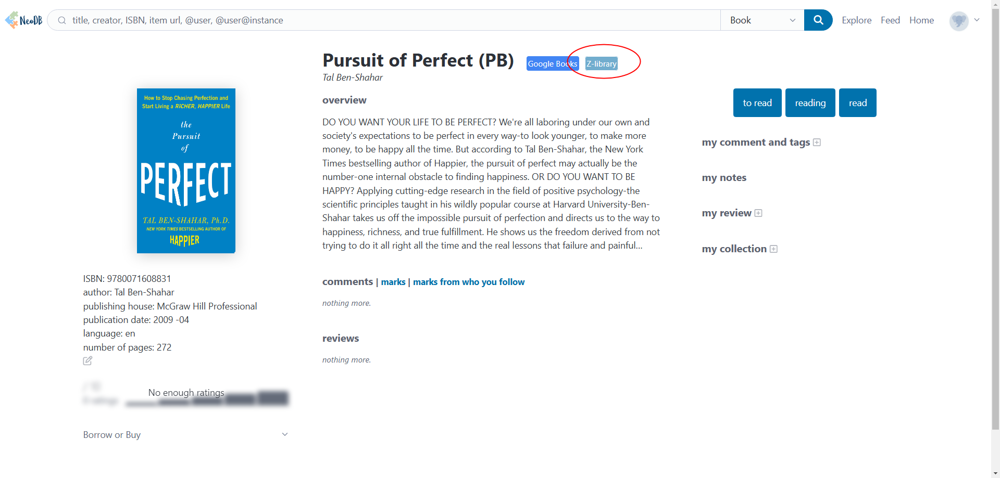

# Z-library for NeoDB

add a shortcut link on NeoDB books for search book in Z-library.

## How to use

1. install `Tampermonkey` on your Chrome.
2. install the script [here](https://greasyfork.org/en/scripts/501440-z-library-for-neodb).
